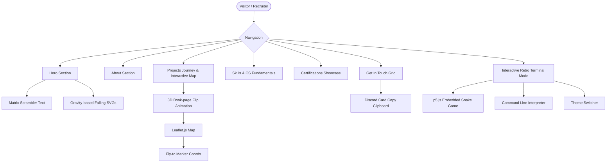

# Hi, I'm Nishant Kumar 👋
### Computer Science Undergraduate | Full-Stack Developer | IoT Enthusiast | Defence Technology Explorer

---

## 👨‍💻 Profile Summary

I am a highly driven **Computer Science Undergraduate** at **KL University** specializing in **Artificial Intelligence & Machine Learning**. I have a strong passion for designing scalable backend systems, developing responsive interactive frontends, and building hardware-level IoT/embedded solutions.

* 🎓 **B.Tech CSE** at KL University, Vaddeswaram
* 💻 **Full-Stack Development** using React, Spring Boot, and modern CSS systems
* ☕ **Backend Architecture** focusing on REST APIs, JWT authentication, and RBAC
* 📡 **IoT & Embedded Systems** flashing firmware onto ESP32 and Arduino boards
* 🏛 **Defence Technology Explorer** fascinated by aerospace & military tech innovation
* 🚀 **Product Building Mindset** focused on shipping functional, polished solutions

---

## 🛠 Skills & Profile Badges


---

## 🚀 Project Overview: Neo-Brutalist Portfolio

> [!NOTE]
> This repository houses my personal portfolio site — a custom-crafted playground built entirely using vanilla **HTML**, **CSS**, and **JavaScript** (no heavy frameworks, no bloated dependencies). 

### 💡 The Problem
Standard developer portfolios look identical: rounded corners, smooth pastel gradients, minimalist gray grids, and cookie-cutter templates. They lack distinct personality and fail to show a strong mastery of front-end engineering fundamentals.

### 🎯 Purpose of the Project
To construct a highly memorable, high-impact personal landing page that stands out to technical recruiters. It serves as a visual showcase of my engineering projects, skills, certifications, and interest areas using a customized **Neo-Brutalist Scrapbook** design language.

### 🌟 Real-World Impact
Demonstrates raw front-end performance, custom animation engineering (custom 3D transforms, gravity-based falling physics), interactive map controllers, and a retro retro-terminal mode that runs an embedded game.

---

## ✨ Key Features

* **🎨 Responsive Neo-Brutalist Design**: Thick black borders (`4px solid`), flat offset shadows, high-contrast HSL-curated color palettes, and playful scrapbook details.
* **🗺 Interactive Project Map**: Embedded Leaflet.js coordinate map showing project hotspots. Clicking timeline entries triggers map fly-to marker animations.
* **📖 3D Book-Flip Timeline**: Interactive "Projects Journey" section that starts as a closed treasure map and dynamically flips open like a book page as the user scrolls.
* **⚡ Interactive Retro Terminal**: Access a retro command-line terminal featuring horizontal/vertical panes, theme switches (Dracula, Nord, Solarized), and an embedded Snake game powered by p5.js.
* **🛸 Scroll-Driven Highlights**: Highlights and markup lines dynamically animate left-to-right as they enter the viewport, simulating a highlighter pen.
* **📲 Tactile Discord Clipboard Copy**: A customized Discord card that copies `og_nishantjod_47792` to the clipboard on-click, showing `"Copied!"` visual feedback.

---

## 🏗 Portfolio Architecture

The application is completely static, optimized for high-speed page loads and visual responsiveness.



---

## 🛠 Tech Stack

### Frontend


### Libraries & Fonts
* **Leaflet.js** — Interactive map engine
* **p5.js** — Snake game rendering in retro terminal
* **Font Awesome** — Typography and brand icons
* **Google Fonts** — Space Grotesk, Space Mono, Caveat

### Deployment


---

## 📸 Screenshots

<p align="center">
  <em>Interactive Portfolio Interface Showcase</em>
</p>

```
┌─────────────────────────────────────────────────────────────────┐
│                                                                 │
│   [ HERO SECTION ] - Animated Photo, Falling SVGs, Matrix Intro  │
│                                                                 │
├─────────────────────────────────────────────────────────────────┤
│                                                                 │
│   [ ABOUT ME ] - Highlighter Animation & Custom Profiles        │
│                                                                 │
├─────────────────────────────────────────────────────────────────┤
│                                                                 │
│   [ TIMELINE & MAP ] - 3D Book Flip Page & Leaflet.js Mapping    │
│                                                                 │
├─────────────────────────────────────────────────────────────────┤
│                                                                 │
│   [ CERTIFICATIONS ] - Custom Tally Badges & Credential Grid     │
│                                                                 │
└─────────────────────────────────────────────────────────────────┘
```

---

## 👨‍💻 About the Developer

**Nishant Kumar**
B.Tech CS Student with deep interests in full-stack engineering, firmware development, and geopolitical strategy.

### Emojis/Interests:
* 🏛 **Defence Technology** & Military hardware
* 🚁 **Aerospace & Military Innovation**
* 🤖 **Artificial Intelligence** & Backend AI
* 🌐 **Full-Stack Development** & System Design
* 📡 **IoT & Embedded Systems** (Arduino/ESP32)
* 🌍 **Geopolitics** & International Relations
* 📰 **World Affairs & Current Events**
* 🚀 **Startups & Product Building**

---

## 🤝 Connect With Me

Let's collaborate or discuss software engineering roles!

* 💼 **LinkedIn**: [Nishant Kumar](https://www.linkedin.com/in/nishant-kumar-a166a3305)
* 💻 **GitHub**: [@NISHANT-187](https://github.com/NISHANT-187)
* 🍳 **CodeChef**: [@kl2400033286](https://www.codechef.com/users/kl2400033286)
* 📧 **Email**: [nishant1872005@gmail.com](mailto:nishant1872005@gmail.com)
* 💬 **Discord**: `og_nishantjod_47792` (Display: `OG_NishantJOD`)

---

## 📊 GitHub Statistics

<p align="center">
  
</p>

<p align="center">
  
</p>

---

## 📌 Project Status

* **Status**: Completed / Active Maintenance
* **Future Enhancements**:
  - Integrate a custom physics simulation sandbox on the home page.
  - Expand terminal command capabilities with automated file downloads.
  - Deeper local map integration with customized Stamen raster maps.

---

## 📄 License

This project is **proprietary**. All rights reserved. You may browse the source code for inspiration, but copying, modifying, or redistributing any part of it without written permission is not allowed. See the [LICENSE](LICENSE) file for details.
